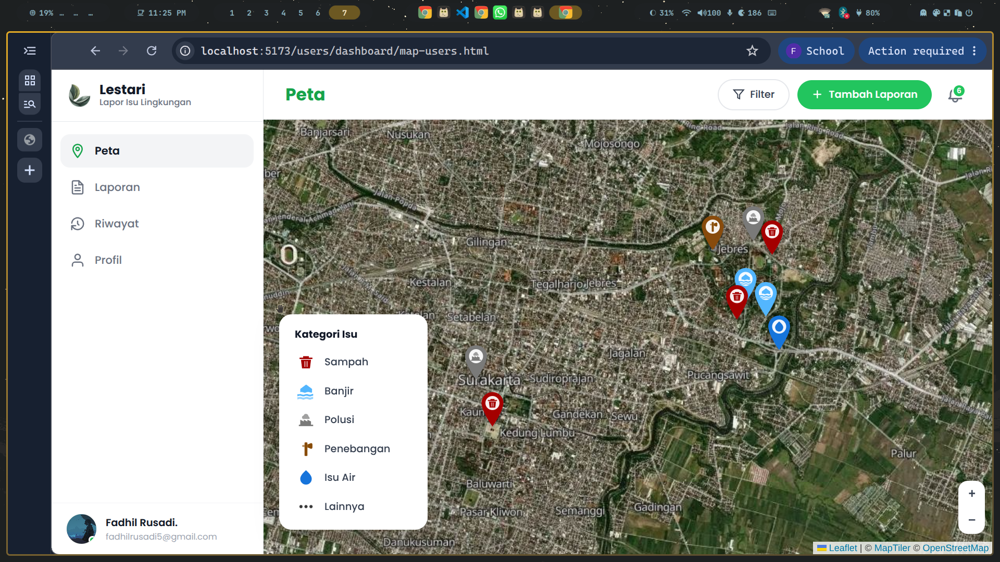
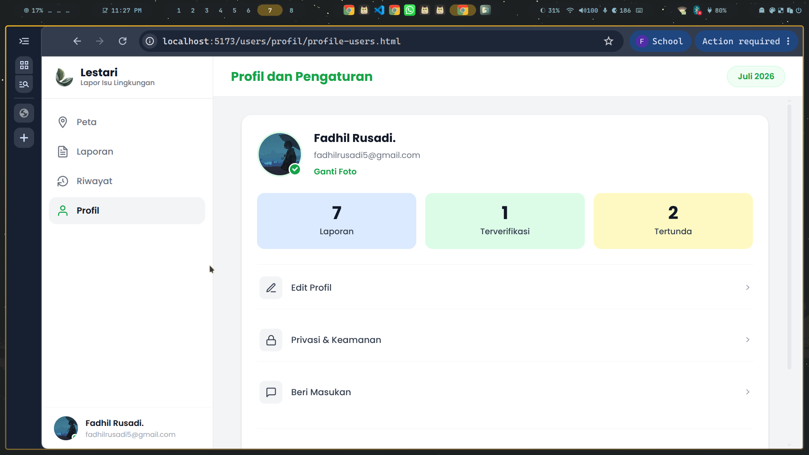
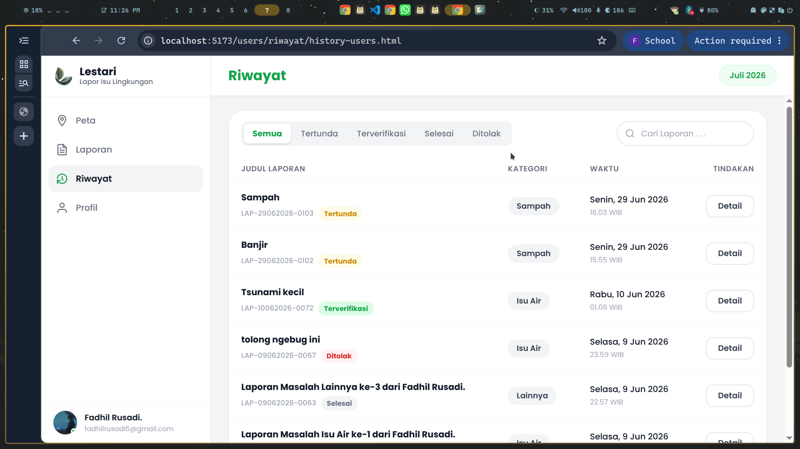

# 🌿 Lestari

**Sistem Pelaporan Permasalahan Lingkungan Berbasis GIS**

---

## 📋 Deskripsi Proyek

Lestari adalah platform berbasis web dan mobile yang memungkinkan masyarakat untuk melaporkan permasalahan lingkungan seperti pencemaran air, sampah liar, dan kerusakan lingkungan lainnya. Laporan dilengkapi dengan lokasi geografis dan foto bukti, kemudian dapat dipantau melalui peta interaktif.

---

## ✨ Fitur

| Kategori | Fitur |
|----------|-------|
| **Must-have** | Registrasi & Login, Login Google OAuth, Login Admin, Pelaporan Laporan, Peta Interaktif |
| **Should-have** | Cek Status Laporan, Upload Foto Bukti, Manajemen Admin (Verifikasi/Tolak/Selesaikan), Dashboard Statistik |
| **Could-have** | Riwayat Laporan, Filter Kategori, Notifikasi Status, Laporan Anonim |
| **Nice-to-have** | Reset Password via OTP, Manajemen Profil, Sistem Feedback |

---

## 📸 Screenshots

| Halaman | Preview |
|---------|---------|
| **Peta Laporan** |  |
| **Buat Laporan** |  |
| **Profil** |  |
| **Riwayat** |  |

---

## 🛠️ Tech Stack

| Layer | Teknologi |
|-------|-----------|
| Frontend Web | HTML, CSS (Vanilla), JavaScript, Vite |
| Backend API | PHP 8+, Laravel 10+ |
| Mobile | Kotlin (Android) |
| Database | PostgreSQL (Supabase) |
| Storage | Supabase Storage |
| Maps | MapTiler API |
| Authentication | JWT, OAuth (Google) |

---

## 📂 Struktur Folder

```
lestari/
├── README.md
├── CHANGELOG.md
├── LICENSE
│
├── docs/
│   ├── ai-usage-log.md
│   ├── api-documentation.md
│   ├── backend-documentation.md
│   ├── database-documentation.md
│   ├── installation-guide.md
│   ├── problem-statement.md
│   ├── srs.md
│   ├── team-contract.md
│   ├── test-cases.md
│   ├── user-manual.md
│   ├── user-stories.md
│   ├── backlog.md
│   ├── data-dictionary.md
│   ├── assets/          # Screenshots
│   ├── presentation/    # Demo slides
│   ├── uml/             # UML diagrams
│   └── wireframe/       # Wireframes
│
├── postman/
│   ├── collections/
│   ├── environments/
│   ├── specs/
│   └── flows/
│
└── src/
    ├── backend/         # Laravel API
    ├── website/         # Frontend web
    └── mobile/          # Android app
```

---

## 🚀 Instalasi

### Prasyarat

| Software | Minimum |
|----------|---------|
| PHP | 8.1+ |
| Composer | 2.x |
| Node.js | 18.x+ |
| PostgreSQL | 14.x |

### Backend

```bash
cd src/backend
composer install
cp .env.example .env
php artisan key:generate
# Konfigurasi database di .env
php artisan migrate
php artisan serve
```

### Frontend Web

```bash
cd src/website
npm install
npm run dev
```

### Mobile (Android)

```bash
cd src/mobile
# Open di Android Studio
# Sync Gradle & Run
```

---

## 👥 Tim

| Nama | NIM | Kontribusi |
|------|-----|------------|
| Fadhil Rusadi | L0124013 | Fullstack (Website) |
| Besty Mega Fauziah | L0124007 | Backend Developer |
| Deoshi Anessah Zheren Areja | L0124009 | Mobile Developer |
| Dina Hamala Nur Rosyidah | L0124010 | Mobile Developer |

---

## 📚 Dokumentasi

| Dokumen | Lokasi |
|---------|--------|
| Problem Statement | `docs/problem-statement.md` |
| User Stories | `docs/user-stories.md` |
| SRS | `docs/srs.md` |
| Team Contract | `docs/team-contract.md` |
| API Docs | `docs/api-documentation.md` |
| Database Docs | `docs/database-documentation.md` |
| Test Cases | `docs/test-cases.md` |
| User Manual | `docs/user-manual.md` |
| Installation Guide | `docs/installation-guide.md` |
| AI Usage Log | `docs/ai-usage-log.md` |
| Presentation | `docs/presentation/demo-slides.md` |

---

## 📄 Lisensi

MIT License - lihat file [LICENSE](LICENSE)

---

*Lestari v1.0.0 - Juli 2026*
